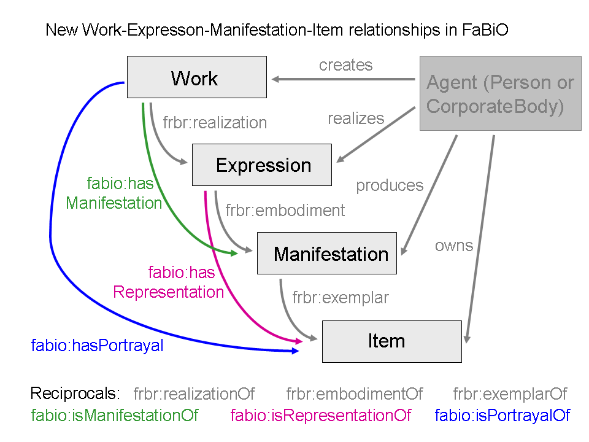

## Description

The _FRBR-aligned Bibliographic Ontology_ (_FaBiO_) is an ontology for recording and publishing on the Semantic Web descriptions of entities that are published or potentially publishable, and that contain or are referred to by bibliographic references, or entities used to define such bibliographic references. 
FaBiO entities are primarily textual publications such as books, magazines, newspapers and journals, and items of their content such as poems, conference papers and editorials. 
However, they also include blogs, web pages, datasets, computer algorithms, experimental protocols, formal specifications and vocabularies, legal records, governmental papers, technical and commercial reports and similar publications, and also anthologies, catalogues and similar collections.

FaBiO already imports several entities from existing standards for bibliographic entity descriptions, i.e., FRBR, DC Terms, PRISM and SKOS. 
In addition, FaBiO has been developed so to limit any restriction to its classes as well as the domains and ranges of its properties. 
This flexibility has the great advantage of allowing FaBiO to be used together with other models.

In particular, FaBiO classes are structured according to the FRBR schema of Works, Expressions, Manifestations and Items. 
The following Graffoo diagram shows additional properties that have been added to extends the FRBR data model by linking Works and Manifestations (`fabio:hasManifestation` and `fabio:isManifestationOf`), Works and Items (`fabio:hasPortrayal` and `fabio:isPortrayedBy`), and Expressions and Items (`fabio:hasRepresentation` and `fabio:isRepresentedBy`).

With FaBiO, it thus becomes possible:

* to write semantic descriptions of a wide variety of bibliographic objects, including conference papers (`fabio:ConferencePaper`), journal articles (`fabio:JournalArticle`), journal issues and volumes (`fabio:JournalIssue` and `fabio:JournalVolume`), using terms that closely resemble the language used in everyday speech by academics and publishers;
* to employ FRBR categories (i.e., `fabio:Work`, `fabio:Expression`, `fabio:Manifestation` and `fabio:Item`, all subclasses of the related FRBR classes) to define clear separations between each part of the publishing process, which involves different people (authors, publishers, readers), depending on which aspect of the bibliographic entity we are considering: the high-level conceptualisation of the research paper, the version of record of that paper forming a journal article, the publication of the article in various formats, and the individual physical or electronic exemplars of the published article that people may read and own;
* to include with ease elements from other vocabularies which describe particular entities involved in the publishing process that are not specified by FaBiO itself, such as those from FOAF for persons and organisations.

## Examples of use

In the following subsections, we introduce some examples to showcase how to use FaBiO. 

The prefixes that are used in all the examples provided below are defined as follows:

    @prefix : <http://www.sparontologies.net/example/> .
    @prefix application: <http://purl.org/NET/mediatypes/application/> .
    @prefix co: <http://purl.org/co/> .
    @prefix dbpedia: <http://dbpedia.org/resource/> .
    @prefix dcterms: <http://purl.org/dc/terms/> .
    @prefix fabio: <http://purl.org/spar/fabio/> .
    @prefix facet: <http://link.springer.com/facet/> .
    @prefix foaf: <http://xmlns.com/foaf/0.1/> .
    @prefix frbr: <http://purl.org/vocab/frbr/core#> .
    @prefix prism: <http://prismstandard.org/namespaces/basic/2.0/> .
    @prefix rdf: <http://www.w3.org/1999/02/22-rdf-syntax-ns#> .
    @prefix rdfs: <http://www.w3.org/2000/01/rdf-schema#> .
    @prefix skos: <http://www.w3.org/2004/02/skos/core#> .
    @prefix xsd: <http://www.w3.org/2001/XMLSchema#> .

### Describing a bibliographic entity

FaBiO allows one to describe information related to a bibliographic entity such as the following one:

* Pompeu Casanovas, Núria Casellas, Christoph Tempich, Denny Vrandečić, Richard Benjamins (2007). OPJK and DILIGENT: ontology modeling in a distributed environment. Artificial Intelligence and Law, 15 (2): 171-186. June 2007. Springer. DOI: 10.1007/s10506-007-9036-2. Print ISSN 0924-8463. Online ISSN 1572-8382. Published online (PDF) May 31, 2007.

From the previous reference we can extract the following information:

1. the document is an academic research article – deducible from the journal in which it is published;
2. Pompeu Casanovas, Núria Casellas, Christoph Tempich, Denny Vrandečić, and Richard Benjamins are the authors of the article;
3. the article was published in 2007;
4. the article is titled `OPJK and DILIGENT: ontology modeling in a distributed environment`;
5. it was published in the 2nd issue of the 15th volume of Artificial Intelligence and Law;
6. the DOI of the article is `10.1007/s10506-007-9036-2`;
7. the Print ISSN of the journal is `0924-8463`;
8. the Online ISSN of the journal is `1572-8382`;
9. the PDF version of the article was published online on May 31, 2007;
10. the journal issue within which the printed version of the article was published bears the publication date June 2007;
11. the page range of the article within the printed version is `171-186`;
12. the publisher of the journal is Springer.

By using FaBiO entities, which also include part of the FRBR, DC Terms and PRISM vocabularies, it is possible to create a full description of all the aspects introduced by the aforementioned twelve points.

    :opjk-and-diligent a fabio:ResearchPaper ;
        dcterms:creator :casanovas , :casellas,
            :tempich, :vrandecic, :benjamins ;
        frbr:realization :version-of-record .

    :version-of-record a fabio:JournalArticle ;
        dcterms:title 'OPJK and DILIGENT: ontology
            modeling in a distributed environment' ;
        fabio:hasPublicationYear '2007'^^xsd:gYear ;
        prism:doi '10.1007/s10506-007-9036-2' ;
        frbr:embodiment :printed , :pdf ;
        frbr:partOf :ai-and-law-15-2 .

    :ai-and-law-15-2 a fabio:JournalIssue ;
        prism:issueIdentifier '2' ;
        frbr:embodiment :printed-issue ;
        frbr:partOf :ai-and-law-15 .

    :ai-and-law-15 a fabio:JournalVolume ;
        prism:volume '15' ;
        frbr:partOf :ai-and-law .

    :ai-and-law a fabio:Journal ;
        dcterms:title 'Artificial Intelligence and Law' .

    :printed-issue a fabio:Paperback ;
        dcterms:publisher :springer ;
        prism:publicationDate '2007-06'^^xsd:gYearMonth ;
        frbr:part :printed .

    :printed a fabio:PrintObject ;
        dcterms:publisher :springer ;
        prism:publicationDate '2007-06'^^xsd:gYearMonth ;
        prism:startingPage '171' ;
        prism:endingPage '186' .

    :pdf a fabio:DigitalManifestation ;
        dcterms:publisher :springer ;
        dcterms:format application:pdf ;
        prism:publicationDate '2007-05-31'^^xsd:date .

    :casanovas a foaf:Person ;
        foaf:givenName 'Pompeu' ;
        foaf:familyName 'Casanovas' .

    :casellas a foaf:Person ;
        foaf:givenName 'Nuria' ;
        foaf:familyName 'Casellas' .

    :tempich a foaf:Person ;
        foaf:givenName 'Christoph' ;
        foaf:familyName 'Tempich' .

    :vrandecic a foaf:Person ;
        foaf:givenName 'Denny' ;
        foaf:familyName 'Vrandečić' .

    :benjamins a foaf:Person ;
        foaf:givenName 'Richard' ;
        foaf:familyName 'Benjamins' .

    :springer a foaf:Organization ;
        foaf:name 'Springer' .

### Specifying ordered lists of authors

Sometimes, it is important to keep track of the actual order the authors of a paper as they appear in the author list. 
The usual approach is to use RDF collections for handling it. 
However, this choice can have several drawbacks, first of all that it is not a fully OWL 2 DL compliant way of modelling ordered items – and this could result in having reasoners running with unexpected behaviour or not running at all.

Even if FaBiO does not handle author ordering directly, it is possible to use it in combination with other pure OWL 2 DL compliant ontologies, such as the Collections Ontology (CO) – that is fully described in the paper 'The Collections Ontology: creating and handling collections in OWL 2 DL frameworks' by Ciccarese and Peroni – which was specifically designed for defining orders among items. 
This ontology allows us to link a co:List of authors through the dcterms:creator property.

    :opjk-and-diligent a fabio:ResearchPaper ;
        dcterms:creator :author-list .

    :author-list a co:List , foaf:Group ;
        co:firstItem :author-item-1 ;
        co:item
            :author-item-1 ,
            :author-item-2 ,
            :author-item-3 ,
            :author-item-4 ,
            :author-item-5 ;
        co:lastItem :author-item-5 ;
        co:size '5'^^xsd:nonNegativeInteger .

    :author-item-1 a co:ListItem ;
        co:index '1'^^xsd:positiveInteger ;
        co:itemContent :casanovas ;
        co:nextItem :author-item-2 .

    :author-item-2 a co:ListItem ;
        co:index '2'^^xsd:positiveInteger ;
        co:itemContent :casellas ;
        co:nextItem :author-item-3 .

    :author-item-3 a co:ListItem ;
        co:index '3'^^xsd:positiveInteger ;
        co:itemContent :tempich ;
        co:nextItem :author-item-4 .

    :author-item-4 a co:ListItem ;
        co:index '4'^^xsd:positiveInteger ;
        co:itemContent :vrandecic ;
        co:nextItem :author-item-5 .

    :author-item-5 a co:ListItem ;
        co:index '5'^^xsd:positiveInteger ;
        co:itemContent :benjamins .

    :casanovas a foaf:Person ;
        foaf:givenName 'Pompeu' ;
        foaf:familyName 'Casanovas' .

    :casellas a foaf:Person ;
        foaf:givenName 'Nuria' ;
        foaf:familyName 'Casellas' .

    :tempich a foaf:Person ;
        foaf:givenName 'Christoph' ;
        foaf:familyName 'Tempich' .

    :vrandecic a foaf:Person ;
        foaf:givenName 'Denny' ;
        foaf:familyName 'Vrandečić' .

    :benjamins a foaf:Person ;
        foaf:givenName 'Richard' ;
        foaf:familyName 'Benjamins' .

### Associating keywords, subject terms and disciplines to a paper

One of the most important needs for a publisher is to categorise each bibliographic entity it produces by adding free-text keywords and/or specific terms structured according to recognised classification systems and/or thesauri developed for specific academic disciplines. 
While through FaBiO the definition of keywords is possible using the PRISM property `prism:keyword`, terms from thesauri, structured vocabularies and classification systems are described using SKOS.

To this end, FaBiO extends some classes and properties of SKOS. 
First of all any FRBR endeavour can be associated (`fabio:hasSubjectTerm`) with one or more descriptive terms (`fabio:SubjectTerm`, a sub-class of `skos:Concept`) found in a specific dictionary (`fabio:TermDictionary`, a sub-class of `skos:ConceptScheme`) that is relevant to (`fabio:hasDiscipline`) particular disciplines (`fabio:SubjectDiscipline`, also a sub-class of `skos:Concept`) describing a field of knowledge or human activity such as computer science, biology, economics, cookery or swimming. 
At the same time, the subject disciplines can be grouped by an opportune vocabulary (i.e., `fabio:DisciplineDictionary`).

    :opjk-and-diligent a fabio:ResearchPaper ;
        fabio:hasSubjectTerm
            facet:air-and-space-law ,
            facet:computational-linguistics ,
            facet:philosophy-of-law ,
            facet:legal-aspects-of-computing ,
            facet:artificial-intelligence-incl-robotics ;
        prism:keywords
            'legal ontologies' ,
            'methodology' ,
            'ontology modeling' ,
            'professional knowledge' ,
            'rhetorical structure theory' .

    <http://link.springer.com/facet> a fabio:TermDictionary ;
        skos:prefLabel 'Facet dictionary used in Springer library' ;
        fabio:hasDiscipline
            dbpedia:Computer_science ,
            dbpedia:Law .

    facet:air-and-space-law a fabio:SubjectTerm ;
        skos:prefLabel 'Air and Space Law' ;
        skos:inScheme <http://link.springer.com/facet> .

    facet:computational-linguistics a fabio:SubjectTerm ;
        skos:prefLabel 'Computational Linguistics' ;
        skos:inScheme <http://link.springer.com/facet> .

    facet:philosophy-of-law a fabio:SubjectTerm ;
        skos:prefLabel 'Philosophy of Law' ;
        skos:inScheme <http://link.springer.com/facet> .

    facet:legal-aspects-of-computing a fabio:SubjectTerm ;
        skos:prefLabel 'Legal Aspects of Computing' ;
        skos:inScheme <http://link.springer.com/facet> .

    facet:artificial-intelligence-incl-robotics a fabio:SubjectTerm ;
        skos:prefLabel 'Artificial Intelligence (incl. Robotics)' ;
        skos:inScheme <http://link.springer.com/facet> .

## Competency Questions

FaBiO can be used for answering several questions related to bibliographic objects and other entities involved in the publishing process.

In the following subsections, some of them are introduced together with their respective SPARQL queries. 

The prefixes that are used in all the SPARQL queries provided below are defined as follows:

    PREFIX dcterms: <http://purl.org/dc/terms/>
    PREFIX fabio: <http://purl.org/spar/fabio/>
    PREFIX foaf: <http://xmlns.com/foaf/0.1/>
    PREFIX frbr: <http://purl.org/vocab/frbr/core#>
    PREFIX prism: <http://prismstandard.org/namespaces/basic/2.0/>
    PREFIX skos: <http://www.w3.org/2004/02/skos/core#>

### CQ1

What are the titles and publication years of all available journal articles?

    SELECT ?title ?year
    WHERE {
    ?article a fabio:JournalArticle ;
            dcterms:title ?title ;
            fabio:hasPublicationYear ?year .
    }

### CQ2

Who are the authors (first and last names) of the article with the DOI '10.1007/s10506-007-9036-2'?

    SELECT ?givenName ?familyName
    WHERE {
    ?article a fabio:JournalArticle ;
            prism:doi '10.1007/s10506-007-9036-2' .
    
    ?paper a fabio:ResearchPaper ;
            frbr:realization ?article ;
            dcterms:creator ?author .
    
    ?author foaf:givenName ?givenName ;
            foaf:familyName ?familyName .
    }

### CQ3

In which journal, volume, and issue was the article with the DOI '10.1007/s10506-007-9036-2'?

    SELECT ?journalTitle ?volume ?issue
    WHERE {
    ?article a fabio:JournalArticle ;
            prism:doi '10.1007/s10506-007-9036-2' ;
            frbr:partOf ?journalIssue .
    
    ?journalIssue a fabio:JournalIssue ;
            prism:issueIdentifier ?issue ;
            frbr:partOf ?journalVolume .
    
    ?journalVolume a fabio:JournalVolume ;
            prism:volume ?volume ;
            frbr:partOf ?journal .
    
    ?journal a fabio:Journal ;
            dcterms:title ?journalTitle .
    }

### CQ4

What are the keywords associated with the article with the DOI '10.1007/s10506-007-9036-2'?

    SELECT ?keyword
    WHERE {
    ?article a fabio:JournalArticle ;
            prism:doi '10.1007/s10506-007-9036-2' .
    
    ?paper a fabio:ResearchPaper ;
            prism:keywords ?keyword .
    }

### CQ5

What are the preferred labels of all subject terms assigned to the article with the DOI '10.1007/s10506-007-9036-2'?

    SELECT ?keyword
    WHERE {
    ?article a fabio:JournalArticle ;
            prism:doi '10.1007/s10506-007-9036-2' .
    
    ?paper a fabio:ResearchPaper ;
            fabio:hasSubjectTerm ?subjectTerm .

    ?subjectTerm a fabio:SubjectTerm ;
            skos:prefLabel ?subjectLabel .
    }